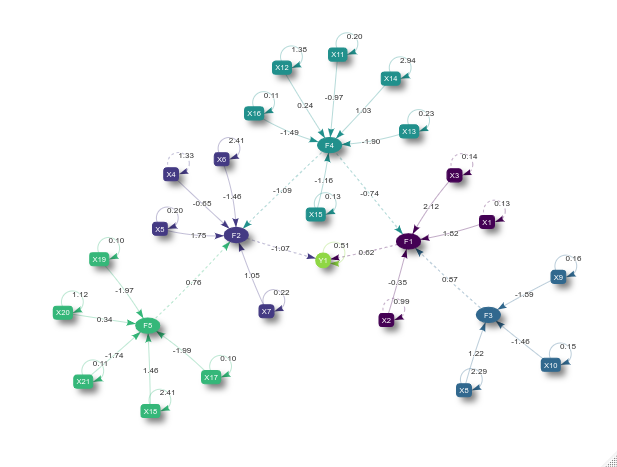
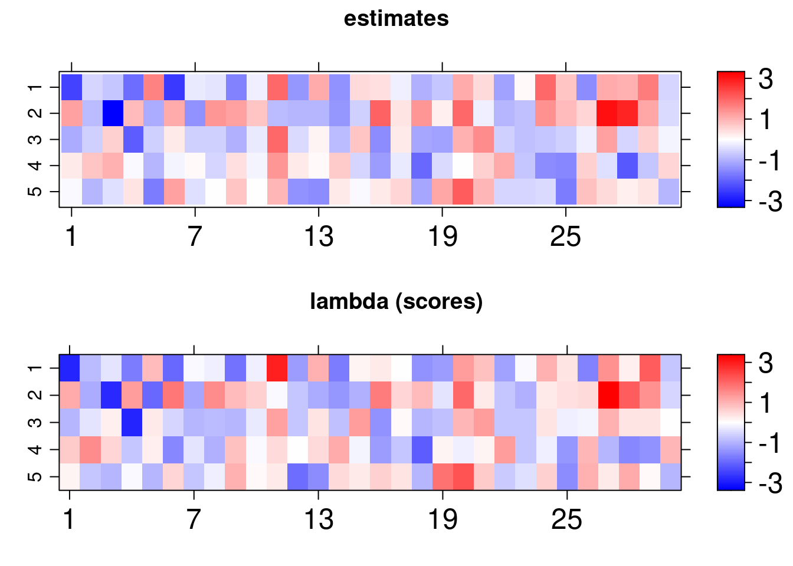

<style>
body {
text-align: justify
</style>


```{r, setup, echo = F}
knitr::opts_chunk$set(fig.width = 6, fig.height = 6, eval = FALSE, echo =  TRUE)
```

```{r, echo = F}
set.seed(2020)
```

# Introduction

This vignette introduces the `bsem` package routines. This package was designed to allow particular cases of structural equation models (SEMs) in `R`. Examples include confirmatory factor analysis (CFA) and confirmatory SEM. The flexible full SEM model (outer model + inner model), implemented here, enables the evaluation of user-defined constructs (latent variables) along with the analysis of established relationships among the latent scores (factors depending on other factors) and/or exogenous variables (variables depending on factors).

Factor analysis (FA) is a powerful and flexible tool to investigate the multivariate dependence in a data set. The main aim is to reduce dimension, i.e., summarize the information expressed in multiple observed variables. The summarization process involves the construction of a few unobserved latent factors representing the existing subjacent patterns in the data. The usual FA can be divided into two types: exploratory (EFA) and confirmatory (CFA). The EFA does not impose any restriction on the relationship between latent factors and observed variables (the model is free to establish such associations). The CFA accounts for the technical information regarding the connections between observed and latent variables; examples of applications involving the CFA can be found in [Brown](https://www.guilford.com/books/Confirmatory-Factor-Analysis-for-Applied-Research/Timothy-Brown/9781462515363) (2015). In this case, the researcher must impose that a factor is exclusively explained by a group of observed variables. The CFA is widely used in the context of SEM, see the references  [Lee and Song](https://link.springer.com/article/10.1007/BF02296651) (2003), [Skrondal and Rabe-Hesketh](https://www.routledge.com/Generalized-Latent-Variable-Modeling-Multilevel-Longitudinal-and-Structural/Skrondal-Rabe-Hesketh/p/book/9781584880004) (2004), [Palomo, Dunson, and Bollen](https://www.elsevier.com/books/handbook-of-latent-variable-and-related-models/lee/978-0-444-52044-9) (2007), [Hoyle](https://www.guilford.com/books/Handbook-of-Structural-Equation-Modeling/Rick-Hoyle/9781462516797) (2014) and [Keith](https://www.routledge.com/Multiple-Regression-and-Beyond-An-Introduction-to-Multiple-Regression/Keith/p/book/9781138061446)(2019). Besides the EFA and CFA, it is possible to work with an intermediate case combining these two types. This option can be seen as a semi-confirmatory FA and an example is described in [Mayrink and Lucas](https://projecteuclid.org/DPubS?service=UI&version=1.0&verb=Display&handle=euclid.aoas/1372338468) (2013) and [Mayrink and Lucas](https://projecteuclid.org/euclid.bjps/1414674773) (2015).

The structure of an SEM has two parts, one involving a CFA and another with multiple regression equations. For an overview of SEMs, it is recommended to read the work [Sanchez et al.](https://www.jstor.org/stable/27590684?seq=1) (2005), which is focused on applications in epidemiology. The studies [Anderson and Gerbing](https://psycnet.apa.org/doiLanding?doi=10.1037%2F0033-2909.103.3.411) (1988) and [MacCallum and Austin](https://doi.org/10.1146/annurev.psych.51.1.201) (2000) provide an overview of the use of SEM in psychology. Examples using SEMs in the context of Bayesian inference are discussed in [Palomo, Dunson, and Bollen](https://www.elsevier.com/books/handbook-of-latent-variable-and-related-models/lee/978-0-444-52044-9) (2007). A clear advantage of using the Bayesian approach is the fact that asymptotic assumptions, required by frequentist maximum likelihood methods, may not be valid depending on the sample size. The reference [Lee and Song](https://link.springer.com/article/10.1007/BF02296651) (2003) highlights the good performance of the Bayesian SEM in a comparison with the frequentist version.

Consider:

- the outer model (blocks) as:
$$\boldsymbol{X_{p\times n}} = \boldsymbol{\alpha}_{p\times k}\boldsymbol{\lambda}_{k\times n} +\boldsymbol{\varepsilon}_{p\times n}$$
where $\boldsymbol{X}$ is the data matrix with variables in the rows and sample elements in the columns,  $\boldsymbol{\alpha}_{p\times j}$ is the column vector of loadings for the $j^{th}$ latent variable and $\boldsymbol{\lambda}_{j\times n}$ is the row vector of scores for the  $j^{th}$ unobserved variable,$~j =1,\dots,k$. Normality is assumed for the errors as $\boldsymbol{\varepsilon}_{ij}\sim N(0, \sigma_{i}^2)$ for $i = 1,\dots, p$.

- the inner model as:
  - paths:
$$\boldsymbol{\lambda}_{j\times n} = \boldsymbol{\beta}^{\top} {\lambda^{(-j)}}  + \nu~$$
where $\boldsymbol{\beta}$ is a column vector of constant coefficients, ${\lambda^{(-j)}}_{ (k-1)\times n}$ represents a subset of the matrix of scores, i.e. at least excluding the $j^{th}$ row scores. The errors are independent and assume $\nu_j \sim N(0,1)$.

  - exogenous:
$$\boldsymbol{Y}_{l\times n} = \boldsymbol{\gamma_0} + \boldsymbol{\gamma}^{\top} {\lambda}  + \xi~$$
where $\boldsymbol{\gamma}$ is a column vector of constant coefficients and $\boldsymbol{\gamma_0}$ is the intercept. $\lambda_{k \times n}$ is the matrix of scores. The errors are independent and assume $\xi_l\sim N(0,\tau_l^2)$.

The guidelines in this document were divided into 4 sections: [installation](#installation), [description](#description), [usage](#usage), and [remarks](#remarks).

# Installation

The ``bsem`` package imports  ``Stan`` software specific routines to support internal calculations. The [``rstan``](https://mc-stan.org/users/interfaces/rstan) package interface enables the use of the NUTS algorithm ( [Hoffman and Gelman, 2014](http://www.stat.columbia.edu/~gelman/research/published/nuts.pdf))  to explore the posterior distribution efficiently in R. The development version of ``bsem`` can be found in [github.com/rvpanaro/bsem](https://github.com/rvpanaro/bsem).

For github version:

```{r}
library("devtools")
devtools::install_github("rvpanaro/bsem", dependencies = TRUE)
```

For CRAN version:

```{r}
install.packages("bsem", dependencies = TRUE)
```

During the installation, dependencies might be required, such as ``magrittr``, ``lattice``, ``viridis``, ``coda``, ``DiagrammeR``, ``visNetwork`` and, obviously, ``rstan`` and its dependencies. Other packages are also suggested such as ``ggplot2``, ``bayesplot`` and ``tidybayes``. The default arguments used to build the ``bsem::sem`` routine will be introduced in the next sections, this is the main function of the package, as it allows the Bayesian analysis for SEM and its particular cases.

# Description

The data and additional commands are passed through the ``bsem::sem`` function:

- ``data``: a mandatory 'matrix' object where the columns are variables and the rows are observations
- ``blocks``: a mandatory named list of ``colnames`` (or integers in 1:ncol(data)) indicating the manifest variables corresponding to each block; generic names are assumed for latent variables internally if not defined
- ``paths``: list referring to the inner model paths; a list of characters or integers referring to the score's relationship; the jth first latent variable is explained if names(paths) is NULL
- ``exogenous``:     
list referring to the inner model exogenous; a list of characters or integers referring to the relationship between exogenous and latent variables; the lth first columns are explained if names(exogenous) is NULL
- ``signals``: list referring to the signals of the factor loadings initial values; must be true: (length(signals) == length(blocks)) && (lengths(signals) == lengths(blocks))
- ``row_names``: optional identifier for the observations (observation = row);
- ``prior_specs``: prior settings for the Bayesian approach; only 'normal' and 'cauchy' for gamma0, gamma and beta; 'gamma', 'lognormal' and 'inv_gamma' for sigma2 and tau2 are available, those prior specifications are ignored if not needed (FA or SEM)
- ``cores``: number of core threads to be used
- ``pars``: allows parameters to omitted in the outcome; options are any subset of default c("alpha", "lambda", "sigma2")
- ``iter``: number of iterations
- ``chains``: number of chains 
- ``scaled``: logical; indicates whether to center and scale the data; default FALSE
- ``...``: further arguments passed to Stan such as warmup, adapt_delta, and others, see rstan::sampling.


```{r}
sem(
  data,
  blocks,
  paths,
  exogenous,
  signals,
  row_names = rownames(data),
  prior_specs = list(
    beta = c("normal(0,1)"),
    sigma2 = c("inv_gamma(2.1, 1.1)"),
    gamma0 = c("normal(0,1)"), gamma = c("normal(0,1)"),
    tau2 = c("inv_gamma(2.1, 1.1)")
  ),
  cores = parallel::detectCores(),
  pars = c("alpha", "lambda", "sigma2"),
  iter = 2000,
  chains = 4,
  scaled = FALSE,
  ...
)
```

The above function automatically selects the appropriate routine according to the specified arguments, examples are given in the following vignette. [Exploring bsem class](exploring-bsem-class.html)  has details on how to simulate datasets considering the structures described. One can reproduce the examples below by copying and pasting the following code to the ``R`` console.  For these examples, simulated artificial data sets were created so that we can verify that the estimates are close enough to the true value of the parameters used to generate the data.

# Usage

In this section, we will use simulated data from the full model described in the introduction. In many applications, with the help of technical knowledge, it is possible to establish relationships between all variables in the data set and the latent variables (constructs) studied, this characterizes the confirmatory factor analysis (CFA). Besides that,
we can also verify linear relationships between observed, latent, and/or exogenous variables. The basic structure suitable to allow bsem usage is as follows:

```{r, eval = TRUE}
dt <- bsem::simdata()
names(dt)
```

In this example, `data` is a matrix, `real` is the set of parameters used to generate the simulated data as described in the intro. `blocks`, `signals`, `paths` and `exogenous` are lists that define the modeling. It is worth mentioning that all lists are named, either by the user or internally. The `paths` should be named after ``block`` names and the `exogenous` list after the colnames of the data, i.e. variable names. The list scheme is useful to describe one relationship between variables and a factor at a time. For example:

```{r, eval = TRUE}
dt$exogenous
```

The latent scores ``F1`` and ``F2`` are the explanatory variables of the exogenous variable ``Y1``. The ``paths`` list also represents a linear regression model, while the ``blocks`` list determines the CFA part of the model.

```{r, eval = TRUE}
dt$blocks
```

In this example, the first 3 variables in the dataset manifest the latent variable ``F1``, we will refer to it as the first block.

```{r, eval = TRUE}
colnames(dt$data)
```

Note that the manifest variables can not include exogenous variables in ``dt$data``. Thus, the first block is expressed by ``X1``, ``X2``,  and ``X3``, as the variable ``Y`` is internally considered just for the inner part. 

``data``, ``blocks``, ``paths`` and ``exogenous`` arguments should specify the SEM model with exogenous variables:

```{r}
fit <- bsem::sem(
  data = dt$data,
  blocks = dt$blocks,
  paths = dt$paths,
  exogenous = dt$exogenous,
  signals = dt$signals
  )

fit
```

```r
---
bsem model:  semEX 
latent variables (outer model):  5 
regressions (inner model):  2 
exogenous variables:  1 


 outer model loadings (alpha):

 F1 
      mean     50%     sd   HPD.l   HPD.u n_eff  Rhat
X1  1.8197  1.7972 0.2605  1.3350  2.3161   316 1.012
X2 -0.3477 -0.3406 0.1566 -0.6556 -0.0429  2525 1.000
X3  2.1240  2.0980 0.3056  1.5541  2.7079   308 1.012

 F2 
      mean     50%     sd   HPD.l   HPD.u n_eff  Rhat
X4 -0.6499 -0.6326 0.1816 -0.9907 -0.2947  1098 1.003
X5  1.7495  1.7178 0.2580  1.2934  2.2814   368 1.009
X6 -1.4583 -1.4304 0.2916 -2.0355 -0.8950   666 1.005
X7  1.0505  1.0325 0.1617  0.7577  1.3752   409 1.009

 F3 
      mean    50%     sd   HPD.l  HPD.u n_eff  Rhat
X8   1.223  1.206 0.3445  0.5423  1.890  1478 1.000
X9  -1.893 -1.860 0.2805 -2.4365 -1.385   436 1.002
X10 -1.463 -1.438 0.2210 -1.9096 -1.073   438 1.002

 F4 
       mean     50%     sd  HPD.l   HPD.u n_eff  Rhat
X11 -0.9687 -0.9521 0.1607 -1.292 -0.6674   517 1.009
X12  0.2422  0.2433 0.2520 -0.240  0.7702  5447 1.002
X13 -1.9023 -1.8692 0.2806 -2.470 -1.3909   409 1.012
X14  1.0326  1.0120 0.3873  0.267  1.7872  2056 1.002
X15 -1.1645 -1.1491 0.1774 -1.539 -0.8550   438 1.010
X16 -1.4857 -1.4598 0.2156 -1.923 -1.0949   402 1.012

 F5 
       mean     50%     sd   HPD.l   HPD.u n_eff  Rhat
X17 -1.9887 -1.9565 0.2819 -2.5169 -1.4736   381 1.004
X18  1.4600  1.4349 0.3714  0.7853  2.2319  1082 1.002
X19 -1.9699 -1.9393 0.2792 -2.4921 -1.4650   380 1.005
X20  0.3432  0.3361 0.2211 -0.0969  0.7885  4658 1.001
X21 -1.7444 -1.7163 0.2480 -2.2093 -1.2973   394 1.006

---


 inner model regression coefficients (beta):

 F1 
      mean     50%     sd   HPD.l   HPD.u n_eff  Rhat
F3  0.8727  0.8567 0.2720  0.3744  1.4327   763 1.004
F4 -0.7390 -0.7340 0.2677 -1.2848 -0.2276   930 1.004

 F2 
      mean     50%     sd   HPD.l   HPD.u n_eff  Rhat
F4 -1.0935 -1.0764 0.2867 -1.6376 -0.5264   848 1.003
F5  0.7629  0.7514 0.2510  0.2962  1.2730   699 1.004

---


 exogenous variables regression coefficients (gamma) :

 Y1 
             mean     50%     sd   HPD.l   HPD.u n_eff   Rhat
intercept  1.5024  1.5020 0.1401  1.2286  1.7820  5869 1.0004
F1         0.6172  0.6076 0.1417  0.3586  0.9127   805 1.0029
F2        -1.0714 -1.0542 0.1789 -1.4198 -0.7312   493 1.0059
tau2[1]    0.5109  0.4863 0.1527  0.2531  0.8064  4351 0.9999

---
```

After fitting the model we can to obtain a ``visNetwork`` graph using:

````{r}
plot(fit)
```



The ellipsoidal nodes represent the latent variables, the boxes represent the manifest variables, the dashed lines represent the linear relations among latent scores or between latent scores, and exogenous variables and the solid lines represent the relationship between the manifest and latent variables. Finally, the recursive solid lines refer to the error variance estimate of each manifest or exogenous variable. 

Also, the scores and loadings used to generate the data can be visually compared to the estimates obtained using the ``lattice`` library routines imported in ``arrayplot`` function:

```{r}
gridExtra::grid.arrange(
  bsem::arrayplot(fit$mean_lambda, main = "estimates"),
  bsem::arrayplot(dt$real$lambda, main = "lambda (scores)")
)  

gridExtra::grid.arrange(
  bsem::arrayplot(fit$mean_alpha, main = "estimates"),
  bsem::arrayplot(dt$real$alpha, main = "alpha (loadings)"),
  layout_matrix = matrix(c(1,1,2,2), ncol  = 2)
)
```




For this vignette we fitted the model using just one chain, it is recommended up to 4 chains with 2000 iterations and 1000 warmup samples (standard) to reach the equilibrium distribution. Even so, we found that the estimates follow the pattern of the true values of the parameters:

| Parameter  | Estimate | True |
|------------|----------|------|
| $\beta_1$  | 0.8727   | 1    |
| $\beta_2$  | -0.7390  | -0.5 |
| $\beta_3$  | -1.0935  | -1   |
| $\beta_4$  | 0.7629   | 0.5  |
| $\gamma_0$ | 1.5024   | 1.5  |
| $\gamma_1$ | 0.6172   | 0.5  |
| $\gamma_2$ | -1.0714  | -1   |
| $\tau_1$   | 0.5109   | 0.49 |

The `bsem::summary` routine prints descriptive statistics to the R console:

```{r}
summary(fit)
```

```
---
bsem model:  semEX 
latent variables (outer model):  5 
regressions (inner model):  2 


 outer model loadings (alpha):

 F1 
      mean     50%     sd   HPD.l   HPD.u n_eff  Rhat
X1  1.8197  1.7972 0.2605  1.3350  2.3161   316 1.012
X2 -0.3477 -0.3406 0.1566 -0.6556 -0.0429  2525 1.000
X3  2.1240  2.0980 0.3056  1.5541  2.7079   308 1.012

 F2 
      mean     50%     sd   HPD.l   HPD.u n_eff  Rhat
X4 -0.6499 -0.6326 0.1816 -0.9907 -0.2947  1098 1.003
X5  1.7495  1.7178 0.2580  1.2934  2.2814   368 1.009
X6 -1.4583 -1.4304 0.2916 -2.0355 -0.8950   666 1.005
X7  1.0505  1.0325 0.1617  0.7577  1.3752   409 1.009

 F3 
      mean    50%     sd   HPD.l  HPD.u n_eff  Rhat
X8   1.223  1.206 0.3445  0.5423  1.890  1478 1.000
X9  -1.893 -1.860 0.2805 -2.4365 -1.385   436 1.002
X10 -1.463 -1.438 0.2210 -1.9096 -1.073   438 1.002

 F4 
       mean     50%     sd  HPD.l   HPD.u n_eff  Rhat
X11 -0.9687 -0.9521 0.1607 -1.292 -0.6674   517 1.009
X12  0.2422  0.2433 0.2520 -0.240  0.7702  5447 1.002
X13 -1.9023 -1.8692 0.2806 -2.470 -1.3909   409 1.012
X14  1.0326  1.0120 0.3873  0.267  1.7872  2056 1.002
X15 -1.1645 -1.1491 0.1774 -1.539 -0.8550   438 1.010
X16 -1.4857 -1.4598 0.2156 -1.923 -1.0949   402 1.012

 F5 
       mean     50%     sd   HPD.l   HPD.u n_eff  Rhat
X17 -1.9887 -1.9565 0.2819 -2.5169 -1.4736   381 1.004
X18  1.4600  1.4349 0.3714  0.7853  2.2319  1082 1.002
X19 -1.9699 -1.9393 0.2792 -2.4921 -1.4650   380 1.005
X20  0.3432  0.3361 0.2211 -0.0969  0.7885  4658 1.001
X21 -1.7444 -1.7163 0.2480 -2.2093 -1.2973   394 1.006

---

 idiosyncratic error variances (sigma2):
             mean    50%     sd  HPD.l  HPD.u n_eff   Rhat
sigma2[1]  0.1293 0.1230 0.0417 0.0641 0.2079  2755 1.0007
sigma2[2]  0.9872 0.9453 0.2562 0.5519 1.5001  5222 1.0010
sigma2[3]  0.1435 0.1354 0.0453 0.0704 0.2325  2488 1.0008
sigma2[4]  1.3332 1.2802 0.3480 0.7662 2.0595  5403 1.0010
sigma2[5]  0.2012 0.1869 0.0755 0.0877 0.3558  2227 1.0008
sigma2[6]  2.4066 2.3076 0.6574 1.3179 3.7626  5324 1.0025
sigma2[7]  0.2197 0.2091 0.0690 0.1075 0.3576  3924 1.0004
sigma2[8]  2.2871 2.1924 0.6063 1.2246 3.4539  5228 1.0015
sigma2[9]  0.1585 0.1486 0.0529 0.0749 0.2627  2537 1.0006
sigma2[10] 0.1496 0.1423 0.0473 0.0697 0.2412  3462 1.0005
sigma2[11] 0.1951 0.1853 0.0571 0.1005 0.3106  4350 0.9997
sigma2[12] 1.3807 1.3253 0.3564 0.7304 2.0743  6374 1.0001
sigma2[13] 0.2255 0.2117 0.0781 0.1070 0.3809  2800 1.0002
sigma2[14] 2.9402 2.8238 0.7725 1.6593 4.4969  5357 1.0013
sigma2[15] 0.1331 0.1267 0.0391 0.0711 0.2153  4141 0.9995
sigma2[16] 0.1102 0.1049 0.0325 0.0555 0.1744  4263 1.0013
sigma2[17] 0.1045 0.0999 0.0301 0.0546 0.1608  4080 1.0000
sigma2[18] 2.4130 2.2972 0.6643 1.3143 3.7238  4668 1.0005
sigma2[19] 0.1042 0.0987 0.0305 0.0546 0.1647  4405 1.0005
sigma2[20] 1.1223 1.0727 0.3061 0.6228 1.7134  5664 1.0015
sigma2[21] 0.1057 0.1012 0.0295 0.0596 0.1698  4788 1.0004

---

 inner model regression coefficients (beta):

 F1 
      mean     50%     sd   HPD.l   HPD.u n_eff  Rhat
F3  0.8727  0.8567 0.2720  0.3744  1.4327   763 1.004
F4 -0.7390 -0.7340 0.2677 -1.2848 -0.2276   930 1.004

 F2 
      mean     50%     sd   HPD.l   HPD.u n_eff  Rhat
F4 -1.0935 -1.0764 0.2867 -1.6376 -0.5264   848 1.003
F5  0.7629  0.7514 0.2510  0.2962  1.2730   699 1.004

---

 exogenous regression coefficients (gamma0, gamma, tau2): 

 Y1 
             mean     50%     sd   HPD.l   HPD.u n_eff   Rhat
intercept  1.5024  1.5020 0.1401  1.2286  1.7820  5869 1.0004
F1         0.6172  0.6076 0.1417  0.3586  0.9127   805 1.0029
F2        -1.0714 -1.0542 0.1789 -1.4198 -0.7312   493 1.0059
tau2[1]    0.5109  0.4863 0.1527  0.2531  0.8064  4351 0.9999


Head Rhat:
alpha[13,4] alpha[16,4]  alpha[1,1]  alpha[3,1] lambda[1,4] lambda[1,6] 
      1.012       1.012       1.012       1.012       1.011       1.011 

Tail Rhat:
 sigma2[11]  alpha[9,1]  sigma2[15]  alpha[1,3] alpha[19,1] lambda[5,8] 
     0.9997      0.9997      0.9995      0.9995      0.9994      0.9994 

median PTVE:  91.06 
R2: 27.28% 

---

```

The effective sample size  ``n_eff`` gives an estimate of the independent draws from the posterior distribution, and ``Rhat`` referred to as the potential scale reduction statistic,  is one of the useful ways to monitor whether a chain has converged to the equilibrium distribution. This statistic measures the ratio between the average variation of the samples within each chain and the variation of the combined samples in the chains; if the chains have not converged to a common region, this statistic will be greater than one. Along with the estimates and posterior descriptives, the ``summary`` also provides quantities for the diagnosis of the quality of fit of the factorial model: the percentage of the total variability (of variables in X) explained by factors (``PVTE``) and the $R^2$ statistics adapted for factor analysis (``R2``). 

A crucial difference in obtaining the same statistics printed by the `bsem::summary` function is the use of the ``signals``. The signal specification, (-1 or 1) for each of the factor loadings, forces the initial values of each chain to have the same direction, and, naturally, these chains converge to nearby regions. Otherwise, the loadings signals between chains are often opposite as a consequence of random initialization. To circumvent this issue, the package automatically transforms posterior chains using simple `for` loops and `if` statements to recalculate the descriptives using `rstan::monitor`.

This page was dedicated to illustrating the commands and outcomes of the proposed package. The closing remarks section highlights the most important aspects of user-defined modeling.

# Remarks

The content of this vignette introduces the ``bsem`` package. The current version is ready for the main statistical study in the field of latent variable analysis.

The results obtained with this package vary according to the initial values set for sampling with ``NUTS``. In this sense, we provided user-defined initial values for reproducibility. Also, the number of chains, iterations, and burn-in usually can have a great influence on the analysis. Moreover, ``NUTS`` includes tuning parameters that can control the sampler's behavior, see [documentation](https://mc-stan.org/users/documentation/). From our experience, using just one chain with more iterations can be helpful and convenient depending on the number of parameters adopted in the model specification. Also, highlight the fact that the implemented routines do not support nonlinear or multilevel regression models for paths or exogenous variables.

This document is part of the content submitted to [CRAN](https://cran.r-project.org/). The package is also in public use and is available at
the GitHub development platform, the link is https://github.com/rvpanaro/bsem.
