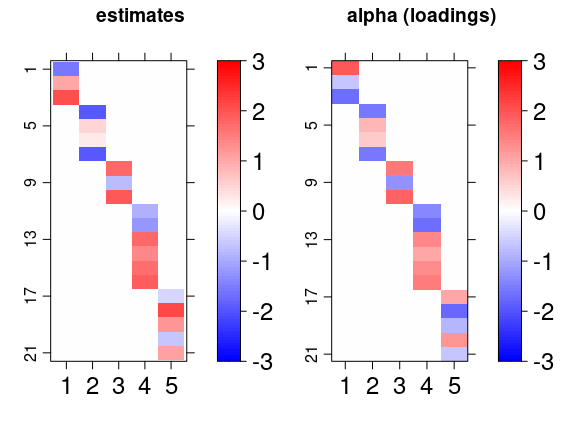
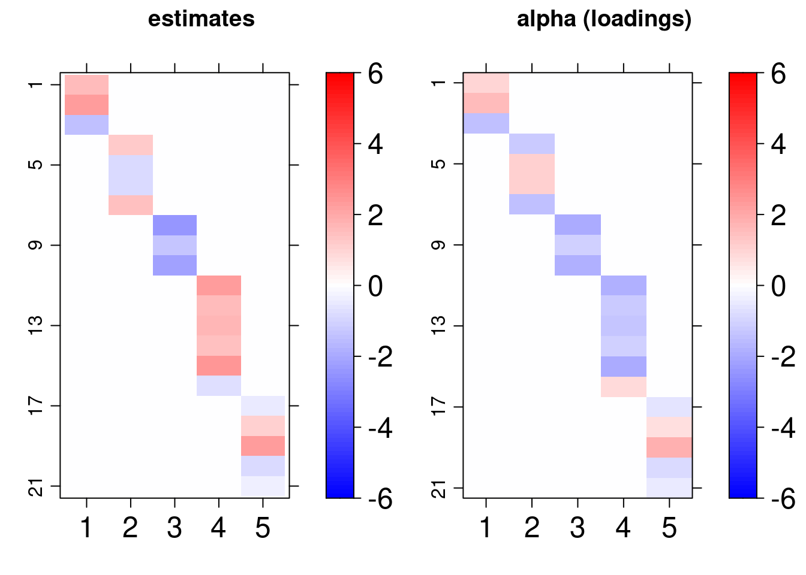
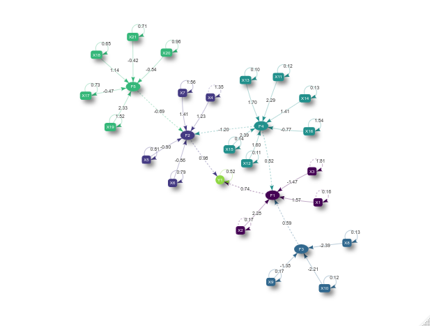
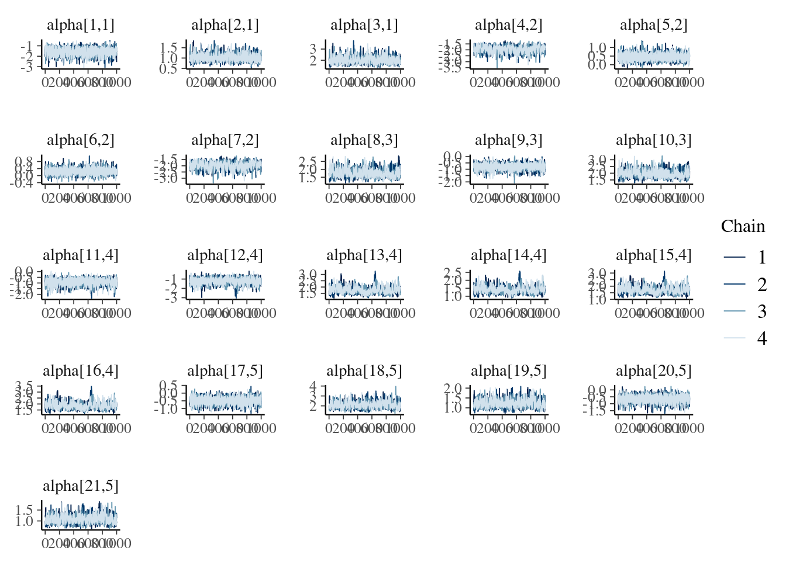
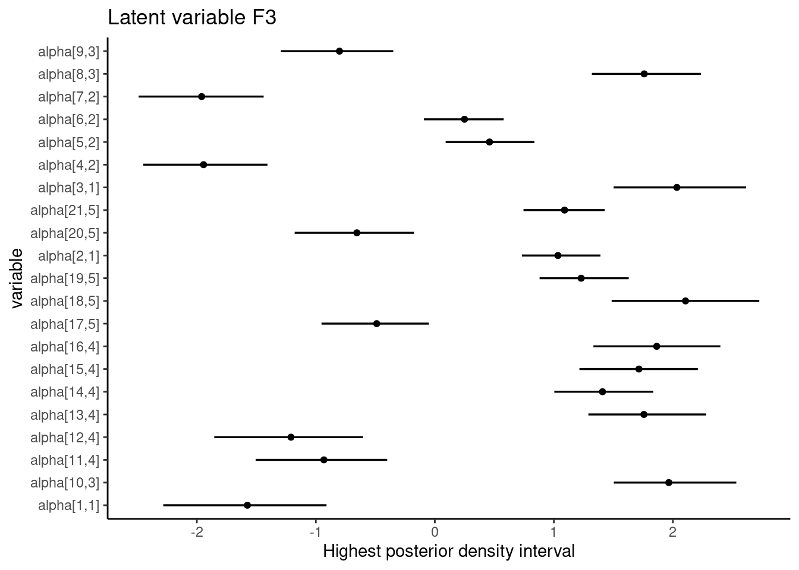

<style>
body {
text-align: justify
</style>

```{r, setup, echo = F}
knitr::opts_chunk$set(fig.width = 6, fig.height = 6, eval = FALSE, echo =  TRUE)
```

This vignette describes how to explore the estimates obtained with `bsem::sem`. In light of replication studies (e.g: Monte Carlo simulation study), we ran a former analysis to validate the proposed framework. We highly recommend the reader to take a look at [Get started](bsem.html) before reading this material as the general model described in the introduction of this vignette is presented next. 
  
## CFA

The main `bsem::sem` routine allows semi or full confirmatory factor analysis (CFA). Thus, at least one variable must be chosen to express each construct before running into the analysis. In other words, the user needs to specify at least one manifest variable that leads each block. In this way, semi-confirmatory FA might assist the researcher in evidencing the possible structures to be tested in a conceptual (full) CFA later on.

The data used in this example was generated using the function `bsem::simdata`, that internally produces artificial variances used to generate normally distributed errors. Also, factor scores (lambda) are generated from a standard normal distribution, and the factor loadings (alpha) from a uniform distribution with support ranging from 0.5 to 2. The factor loading direction (signal) is generated using a simple random sampling. A new artificial data set is wrapped in a list object and can be produced with the following command:

```{r, echo = FALSE}
set.seed(2020)
```

```{r, eval = TRUE}
dt <- bsem::simdata(
  paths = NULL,
  exogenous = NULL
)
```

The `paths` and` exogenous` arguments must be defined as `NULL` to obtain a data set suitable for factor analysis, in which paths or exogenous variables can not be considered. Now, we can run `bsem::sem` to check whether the estimates retrieved are close to the real values of the parameters.

A data matrix and a list of blocks are the only mandatory arguments as they are necessary to represent the manifest variables related to each construct of the outer model. There are two ways to specify a ``sem`` model: 

1. the blocks, paths and exogenous elements are integer vectors referring to the variable (column) position;

2. named lists defined by the user with the factor and variable names, such that the automated print, summary, and plot functions will inherit it.

- In this example we go ahead with the first option, unnamed lists are internally named in both cases.

```{r, eval = TRUE}
dt$blocks
```

Note that the list is named with `c("F1", "F2", "F3", "F4", "F5")`, but the elements refer to column positioning, variable names would be internally converted into positioning if we had the second case.

- Descriptive statistics were based on ``rstan::monitor``:

```{r}
cfa <- bsem::sem(
  data = dt$data,
  blocks = dt$blocks,
  cores = 1
)
```

```{r}
cfa
```

```
---
bsem model:  factorial 
latent variables (outer model):  5 


 outer model loadings (alpha):

 F1 
     mean    50%     sd   HPD.l   HPD.u n_eff  Rhat
X1 -1.575 -1.558 0.3542 -2.2821 -0.9102  1553 1.001
X2  1.034  1.017 0.1707  0.7313  1.3918   960 1.002
X3  2.034  2.003 0.2967  1.5027  2.6158   799 1.002

 F2 
      mean     50%     sd   HPD.l   HPD.u n_eff  Rhat
X4 -1.9434 -1.9209 0.2741 -2.4499 -1.4063   479 1.006
X5  0.4593  0.4530 0.1961  0.0908  0.8368  2364 1.001
X6  0.2493  0.2432 0.1714 -0.0924  0.5783  3888 1.000
X7 -1.9597 -1.9401 0.2785 -2.4888 -1.4385   478 1.005

 F3 
       mean     50%     sd  HPD.l   HPD.u n_eff  Rhat
X8   1.7595  1.7349 0.2391  1.319  2.2364   434 1.013
X9  -0.8013 -0.7855 0.2374 -1.294 -0.3495  2146 1.002
X10  1.9661  1.9377 0.2658  1.504  2.5336   434 1.013

 F4 
      mean     50%     sd  HPD.l   HPD.u n_eff  Rhat
X11 -0.932 -0.9082 0.2841 -1.506 -0.4003  1439 1.001
X12 -1.209 -1.1792 0.3215 -1.854 -0.6037   887 1.004
X13  1.757  1.7269 0.2634  1.290  2.2802   350 1.006
X14  1.409  1.3864 0.2170  1.004  1.8359   370 1.006
X15  1.715  1.6818 0.2613  1.215  2.2108   366 1.005
X16  1.864  1.8294 0.2816  1.333  2.3997   353 1.006

 F5 
       mean     50%     sd   HPD.l   HPD.u n_eff  Rhat
X17 -0.4884 -0.4782 0.2291 -0.9521 -0.0503  2515 1.000
X18  2.1067  2.0780 0.3259  1.4858  2.7265   509 1.006
X19  1.2295  1.2061 0.1988  0.8803  1.6293   519 1.005
X20 -0.6553 -0.6443 0.2576 -1.1779 -0.1751  2113 1.000
X21  1.0900  1.0700 0.1799  0.7451  1.4278   544 1.005

---
```

The descriptive statistics for the posterior factor loadings are shown in the R console inspired on the `rstan` fashion (based on ``rstan::monitor``). Besides, a warning is displayed to remind that the signals of the outer model loadings were not specified. Random initial values are assigned in this case. As a consequence, the direction of the loadings signals  might change, which means that the score rows and loading columns may vary. Remind that the real-valued product $\alpha \lambda$ can have more than one solution.

- The structural model can be easily viewed with the plotting routine `bsem::plot`:

```{r}
plot(cfa)
```


Another interesting visualization of the result is to compare the posterior factor loadings estimates, and also the score estimates, with the true values of these quantities using the `bsem::arrayplot` function. For example:

```{r}
gridExtra::grid.arrange(
  bsem::arrayplot(cfa$mean_lambda, main = "estimates", -3,3),
  bsem::arrayplot(dt$real$lambda, main = "lambda (scores)", -3,3)
)

gridExtra::grid.arrange(
  bsem::arrayplot(cfa$mean_alpha, main = "estimates", -3,3),
  bsem::arrayplot(dt$real$alpha, main = "alpha (loadings)", -3,3),
  layout_matrix = matrix(c(1, 1, 2, 2), ncol = 2)
)
```




From this example, we found that the estimates pattern is tightly close to the one generated with the true value of the parameters even when the signals are not passed. 

Remember each chain runs in a separate thread, thus, it is recommended to specify (default) the number of cores at least equal to the number of chains. Indeed, from our experience, an increase in the number of iterations raises the runtime, but considerably improves the interval and point estimates. 

## SEM

In addition to the CFA structure above, for the SEM we will also consider paths and exogenous variables. The simulated data already described in the [Get started](bsem.html) vignette includes two additional kinds of relationships among observed and latent variables.

1. Exogenous variable regression - variables that are explained by some common factors, those variables are referred to as the exogenous variables.

2. Path modeling regression -  common factors that are explained by some other common factors,  this we will refer to as  a path between two latent variables.

Again, we can use the predefined routine `simdata`.

```{r, eval = TRUE}
dt <- bsem::simdata()
```

```{r}
sem <- bsem::sem(
  data = dt$data,
  blocks = dt$blocks,
  paths = dt$paths,
  exogenous = dt$exogenous
)
```

Similar outcomes can be also obtained for this model and we can one more time conclude that the model estimates are adequate under normality assumption for the errors:




An analogous plot can be retrieved, but in addition to the previous structure, we can observe ellipsoids, boxes and also a circle. The circle represent the exogenous variable, while the ellipses represent the common factors and the boxes the manifest variables. The dashed lines refers to the regression coefficients and the solid ones to the CFA loading.

```{r}
plot(sem)
```



That is not all, the first thing to do after fitting a Bayesian model is to check the posterior to assess whether the estimates are good to describe the proposed CFA or the SEM model.

## Graphical posterior analysis 

This section is an introduction on how to diagnose the adequacy of the estimates using the outputs of `cfa` and `semfit`. For example, we will analyze the CFA result.

### Traceplots and density plots

The posterior samples are returned with `cfa$posterior` and the posterior mean with `cfa$mean_alpha`. 

```{r}
names(cfa$posterior)
dim(cfa$posterior$alpha)
```

```
[1] "alpha"  "lambda" "sigma2"
[1] 1000    4  105

[1] 1000    4  105
```

The dimension indicates that we have got $1000$ after-warmup iterations, 4 chains and 105 loadings. We select one those that we previously considered as manifest variables in the CFA.

```{r}
lnames <- rownames(cfa$mean_alpha)

  find <- paste0("alpha[", which(lnames %in% unlist(cfa$blocks[1:length(cfa$blocks)])), ",", 
                 rep(1:length(cfa$blocks), lengths(cfa$blocks)), "]"
                 )
  bayesplot::mcmc_trace(cfa$posterior$alpha[, , find]
                        )
```




```{r}
lnames <- rownames(cfa$mean_alpha)

  find <- paste0("alpha[", which(lnames %in% unlist(cfa$blocks[1:length(cfa$blocks)])), ",", 
                 rep(1:length(cfa$blocks), lengths(cfa$blocks)), "]"
                 )
  bayesplot::mcmc_dens(cfa$posterior$alpha[, , find]
                        )
```


The plots reveal that the chains are unimodal and have good mixing. The signals between chains might change as mentioned before, while extracting the posterior samples the routine internally compares opposite signal chains and adjust the direction between chains.

## Interval estimate

Two types of intervals can be obtained:  

### HPD interval  
- The narrowest (highest posterior density - HPD) credibility interval can be retrieved using `.$credint`. We have computed HPD intervals for the factor loadings (alpha), scores (lambda), and regression coefficients (beta).

```{r}
names(cfa$credint)
```

```
[1] "alpha"  "lambda" "sigma2"
```

- This data can be used to plot interval estimates using two packages, `ggplot2` and `tidybayes`:

```{r} 
library("ggplot2")
library("tidybayes")
```

- `dt` data.frame object has the mean loadings and the HPD interval lower and upper limits (`li` and `lu`):

```{r}
dt <- data.frame(
  li = cfa$credint$alpha[, 1],
  lu = cfa$credint$alpha[, 2],
  m = c(cfa$mean_alpha)
)
```

- `lnames` and `snames` are used to find the loadings of the conceptual model (those that might not equal zero).

```{r}
lnames <- rownames(cfa$mean_alpha)
snames <- rownames(cfa$mean_lambda)
```

- `find` help us finding these values:
  
```{r}
find <- paste0("alpha[", which(lnames %in% unlist(cfa$blocks)), ",", rep(1:length(cfa$blocks), lengths(cfa$blocks)), "]")

dt <- dt[find, ]
```

- One of the options to plot the loadings HPD intervals chart is:
```{r}
ggplot(aes(y = find, x = m, xmin = li, xmax = lu), data = dt) +
  geom_pointintervalh() +
  theme_classic() +
  labs(
    title = paste("Latent variable", colnames(cfa$mean_alpha)[3]),
    x = "Highest posterior density interval",
    y = "variable"
  )
```




In the SEM example above, all intervals regarding the loading estimates from the conceptual relationships do not include zero. 

### Equal tails interval

Alternatively, it is possible to access equal tails credibility intevals using the `bayesplot` package:

````{r}
library("bayesplot")
```

- `find` help us finding the loading values that have been previously determined to estimate the latent scores:

```{r}
find <- paste0("alpha[", which(lnames %in% unlist(cfa$blocks)), ",",
               rep(1:length(cfa$blocks), lengths(cfa$blocks)), "]")

dt <- dt[find, ]
```

- The equal tails intervals are:

````{r}
gridExtra::grid.arrange(mcmc_areas(cfa$posterior$alpha[, , find]),
  mcmc_intervals(cfa$posterior$alpha[, , find]),
  layout_matrix = matrix(c(1, 1, 2, 2), ncol = 2)
)
````


In addition to the possibilities for intervals, other `mcmc_.` graphs are recommended, several options include histograms, violin plots, pair plots, and others. A good tutorial on how to analyze the posterior using `bayesplot` functions is available at the [bayesplot](https://mc-stan.org/users/interfaces/bayesplot) manual.


The data visualization tools have been covered in this document. More than the options covered here, there is also a `runshiny()` that can be useful to understand the model. The user can upload a .csv dataset and follow the proposed workflow. The code to launch the app is:

```{r}
bsem::runShiny()
```

